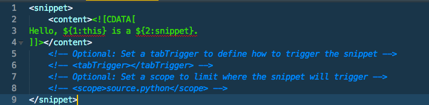
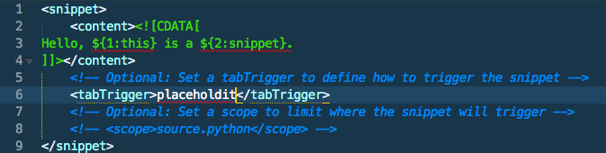
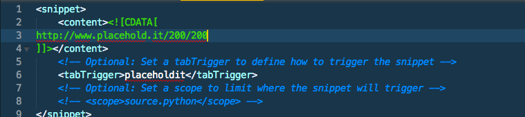

#Sublime Text Speed-Run

Here's a quick document to get you up and running and writing code, along with some tips that should speed up your workflow drastically.

Your text editor is your most cherished and heavily used tool for development, so it makes sense that you would want your editor to be optimized in such a way that would help you do your job. My personal recommendation with regard to text editor is [Sublime Text](http://www.sublimetext.com), which I strongly recommend you download.

Out of the box, Sublime, while it is a great editor as is, is not at it's full potential. Let's go ahead and install Package Control so we can make Sublime more useful for ourselves. Head on over to [the instructions for installing Package Control](https://sublime.wbond.net/installation) and follow the directions exactly, depending on which version (2 or 3) of Sublime that you are using. After you are done installing Package Control, you may (most likely will) need to restart Sublime for Package Control to take effect.

So why am I so adamant about installing Package Control, anyways? Package Control allows us to add packages (duh) that extend the functionality of Sublime by a mile. One of my most used and favourite packages is on called [Emmet](http://www.emmet.io), which I'm going to guide you through the installation of now.

##Installing packages
- First, we're going to tell Sublime that we want to access Package Control. To do this you can either click on `Sublime Text -> Preferences -> Package Control`
- In the interest of saving time, you can also press `super(command on Mac, window key on PC) + shift + p`
- From here, type in "install package". As you type, you'll notice that the search auto-completes for you and you can simply press enter to select this option
- Now, we have access to all the packages available on Sublime. As mentioned before, the one we're specifically looking for right now is called Emmet, so go ahead and start typing that into the search bar (again, you'll notice the auto-complete feature kicking in
- Go ahead and press enter on Emmet to install the package, and once again, you'll probably need to re-start Sublime for the package to take effect

Congrats, you've now installed your first package in Sublime Text!

##Emmet
Now, onto actually using Emmet. Emmet is a plugin that allows you to speed up your actual time spent writing code by a huge factor. It essentially allows you to scaffold your code quite quickly. Let's start with a very simple example.

- Normally, when we want to target a div with a class of wrapper in our CSS, we would write `div.wrapper`, right?
- What Emmet allows us to do is to do the same thing, but with our HTML which is triggered via the tab key, as seen below

- While this might not seem like the biggest deal right now, it can come in super handy when you're writing a bunch of nested elements (again, using the same syntax as you would with CSS), as seen below

- Pretty awesome, right? The best part about this is that you can now simply press tab and Emmet should allow you to simply tab through the areas of the tags that need to be filled out such as the href and the actual content of the link
- You may have noticed that I added multiple classes to the list items, by simply adding another class (again, as you would in CSS) to the list item before scaffolding
- You may have also noticed that on the second class of the list item before scaffolding had a dollar sign at the end. When expanded, it gave each element a class of `menu-item[number]` because Emmet is, behind the scenes, iterating through a loop and generating the numbers for you
- If you're super crafty, you could even get Emmet to scaffold a simple web page for you in a few keystrokes
- 
- There's lots of tricks to Emmet and we've only scratched the surface. While it might feel weird at first, I can promise you that if you spend the time to train yourself to use Emmet properly, it can save you hours of development time. If you ever need a refresher, feel free to check out the [Emmet cheat sheet](http://docs.emmet.io/cheat-sheet/)
- Above all, using Emmmet can help you cut down on errors - it's very easy to miss a closing tag here, a quotation mark there, and Emmet helps you reduce those easily preventable mechanical errors

##Snippets
I think by now you realize that I'm big on cutting down on writing code that you don't have to, hence my love of Emmet. Another great feature of Sublime Text is the ability to create "snippets", which are little bits of code that you can re-use. What Emmet is doing is essentially giving you access to a host of snippets that the Emmet team noticed that they were using frequently, and we can do the same. To create a snippet click on `Tools -> New Snippet`. This should bring you to a new tab that already has some code written on it. Let's take a look to make sense of it while making our own snippet.

###Making our own snippets
- At first, you should see a screen that looks like this:

- It may seem like a pretty confusing and discouraging starting point, but it's actually not so bad once you make sense of it
- The code you see in between `CDATA[` and `]` is where all the code of our snippet will go
- The code you see such as `${1:this}` is where tab indexes begin. Tab indexes are usually words within your snippet that can change easily depending on the context. In this example, once our snippet is called (which we will get to) the cursor will appear there first, and the word `this` will appear, but also be editable
- The code (or lack of, in this particular instance) between `<tabTrigger` and `</tabTrigger>` are the keywords we'll use to call our snippets, which will be called via the tab key
- Let's go ahead and uncomment the line with our tabTrigger code on it (feel free to use the keyboard shortcut `cmnd/windows + /`) and insert the word we would like to trigger our snippet. For this example, please use `placeholdit`

- Now, let's edit the actual portion of the code that will be generated with our tab trigger. In this example, let's start by making our snippet `http://www.placehold.it/200/200`

- At this point we could stop here and call it a day on this snippet, but I think it's reasonable to assume that we will not **always** want to generate a placeholder image that's 200x200 pixels, and since we can save time on this by editing our snippet, I think that we should
 - As I mentioned before, we can set tab indexes on editable portions of code within our snippets to have them better suit our needs
 - For this example, we'll set two tab indexes on the pixel value portions of our snippet, starting with the first dimension, and ending on the second dimension
 - To do this, envelope the first `200` in a pair of curly braces and precede them with a `$` so your snippet code now looks like `http://www.placehold.it/${200}/200`
 - To make this the first tab index, place a `1:` before `200`, so that your code now looks like `http://www.placehold.it/${1:200}/200`
 - Repeat the above steps on the second pixel value, this time replacing `1:` with `2:` to make this value the second editable tab index, your code should now look like this `http://www.placehold.it/${1:200}/${2:200}`
 - At this point, we're done with our snippet for now. The next step is to save it, which follows a very specific format
 - Go ahead and save this snippet, the snippet must be saved in `Sublime Text [version] -> Packages -> User` (which you computer will most likely bring you to automatically) and **must** be saved with a `.sublime-snippet` extension, so in our example, let's save our snippet as `placeholdit.sublime-snippet`
 - Head over to an HTML file, and go ahead an use your snippet wherever appropriate
 